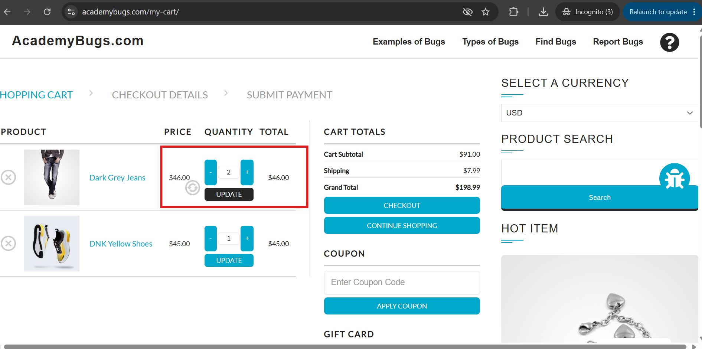
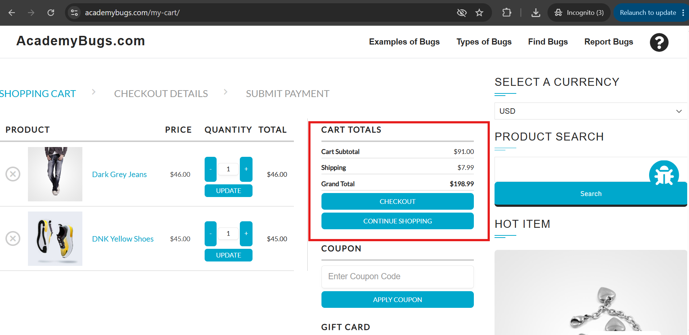
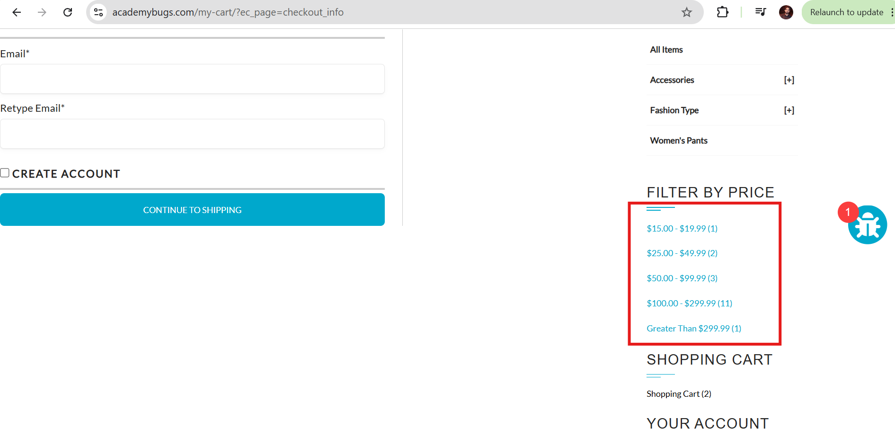
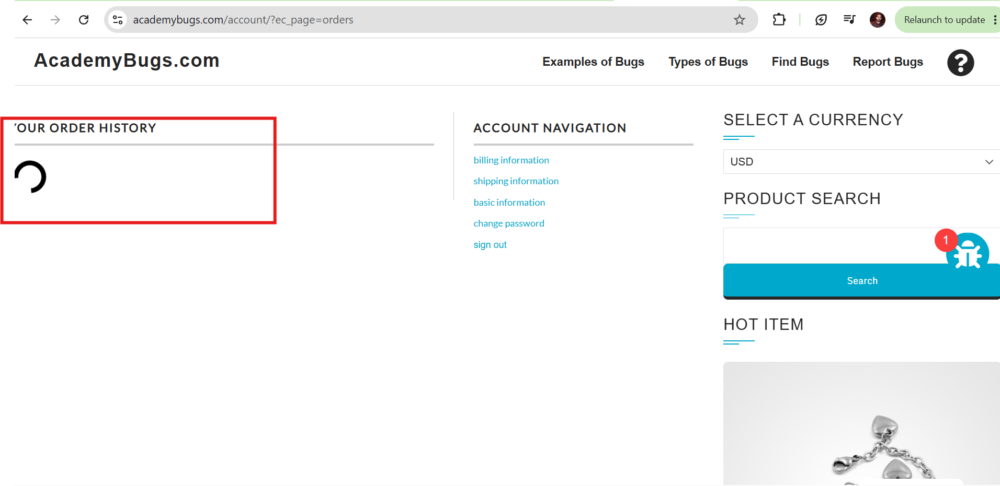
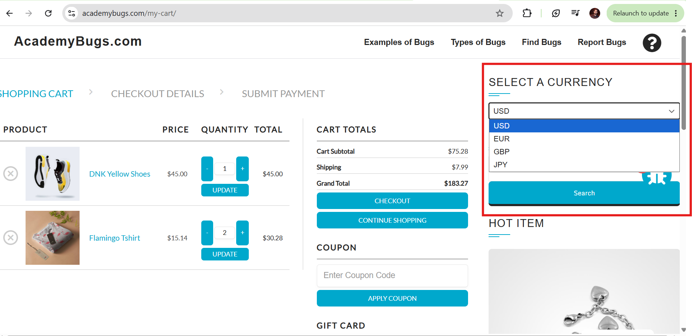
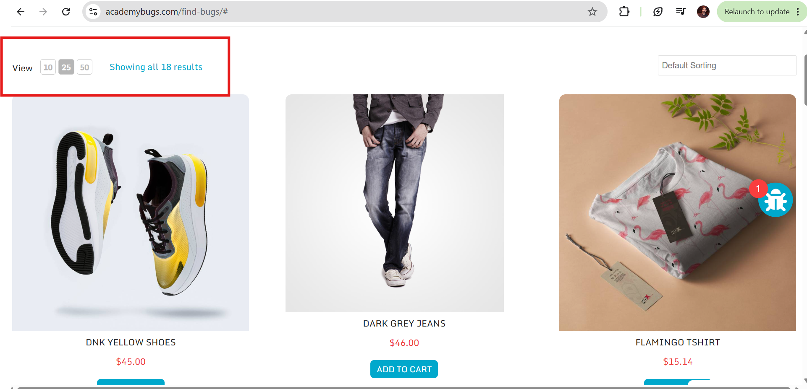
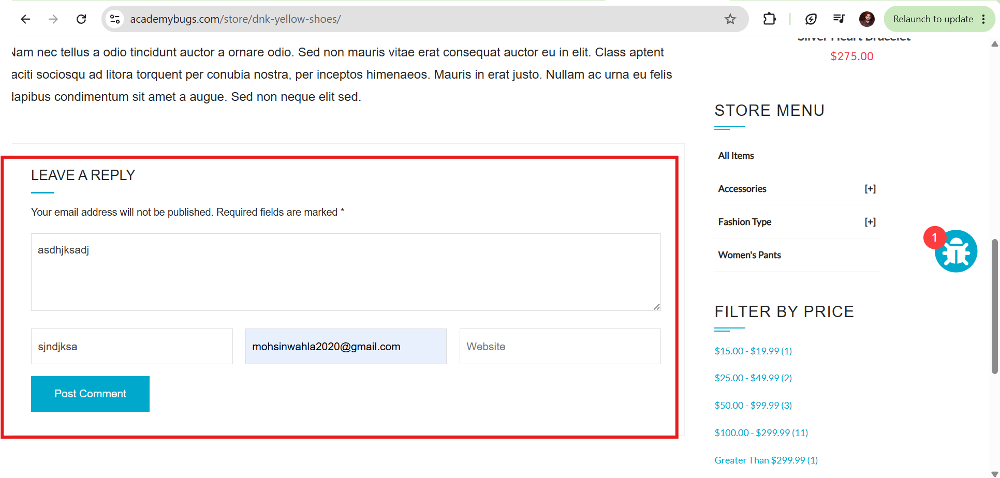
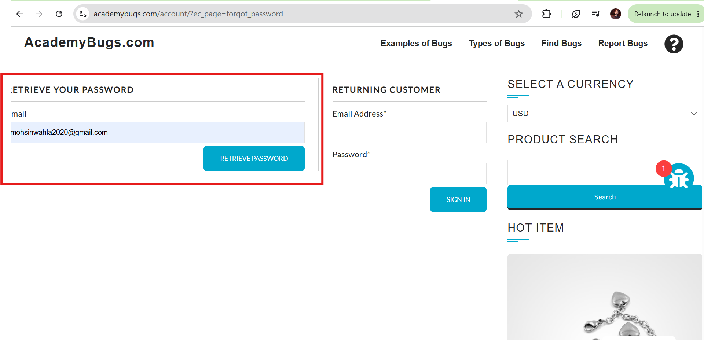

# AcademyBugs - Top 8 Critical Bugs - Manual QA Portfolio
**Tester:** Mohsin Ishfaq | **Date:** Aug 5, 2026 | **URL:** https://academybugs.com/find-bugs/
**Test Cases:** 20 (12 Pass, 8 Fail) | **Bugs:** 8 Genuine Critical (4 Crashes, 2 Functional, 1 Filter, 1 Performance)

## Overview
Exploratory manual testing on AcademyBugs Find Bugs page (25 bugs planted). Focused on Top 8 High severity genuine bugs that matter for e-commerce clients. All verified live on Aug 5, 2026.

## Top 8 Bugs Summary
- **BUG-01 [High]** Cart quantity update fails - stuck at 2
- **BUG-02 [High]** Grand total calculation wrong - random number
- **BUG-03 [High]** Filter by Price broken - no filtering
- **BUG-04 [High]** Order History infinite loop - never loads
- **BUG-05 [High Crash]** Currency change freezes page
- **BUG-06 [High Crash]** View result click freezes page
- **BUG-07 [High Crash]** Post comment freezes page
- **BUG-08 [High Crash]** Forgot password freezes page

## Evidence - Screenshots

### BUG-01: Quantity update bug

### BUG-02: Grant total bug - calculation wrong

### BUG-03: Price filter bug

### BUG-04: Order history infinite loop

### BUG-05: Page freeze currency

### BUG-06: Page freeze on changing view result

### BUG-07: Page freeze post comment

### BUG-08: Page freeze forgot password

## Evidence - Videos (Crash Bugs)

### BUG-02 Video: Grant total calculation - shows random total
https://github.com/mohsin-ishfaq/academybugs-top8-critical-bugs-qa-portfolio/blob/main/06_Evidence/Videos/BUG-grant-total-calculation.mp4

### BUG-05 Video: Currency freeze - page becomes unresponsive
https://github.com/mohsin-ishfaq/academybugs-top8-critical-bugs-qa-portfolio/blob/main/06_Evidence/Videos/BUG-page-freeze-changing-currency.mp4

### BUG-06 Video: View clicking freeze
https://github.com/mohsin-ishfaq/academybugs-top8-critical-bugs-qa-portfolio/blob/main/06_Evidence/Videos/BUG-page-freeze-clicking-view.mp4

### BUG-08 Video: Forgot password freeze
https://github.com/mohsin-ishfaq/academybugs-top8-critical-bugs-qa-portfolio/blob/main/06_Evidence/Videos/BUG-page-freeze-forgot-password.mp4

## Documents
- **Test Plan:** `01_Test_Plan/AcademyBugs_TestPlan_Aug5_2026.docx`
- **Test Cases 20:** `02_Test_Cases/AcademyBugs_20_TestCases_Realistic_Aug5_2026.xlsx` (12 Pass, 8 Fail - realistic)
- **Bug Reports Top 8:** `03_Bug_Reports/AcademyBugs_TOP8_Bugs_Genuine_Aug5_2026.xlsx`
- **RTM:** `04_RTM/AcademyBugs_RTM_Aug5_2026.xlsx`
- **Test Summary:** `05_Test_Summary/AcademyBugs_TestSummary_TOP8_Aug5_2026.docx`

## Test Types Covered (per academybugs.com/types/)
- Functional: Quantity, Grand Total
- Filter: Price filter
- Performance: Order history infinite loop
- Crash: 4 page freezes (currency, view, comment, forgot password)

## Tools
Chrome 126, Lightshot, ShareX, Excel, GitHub
